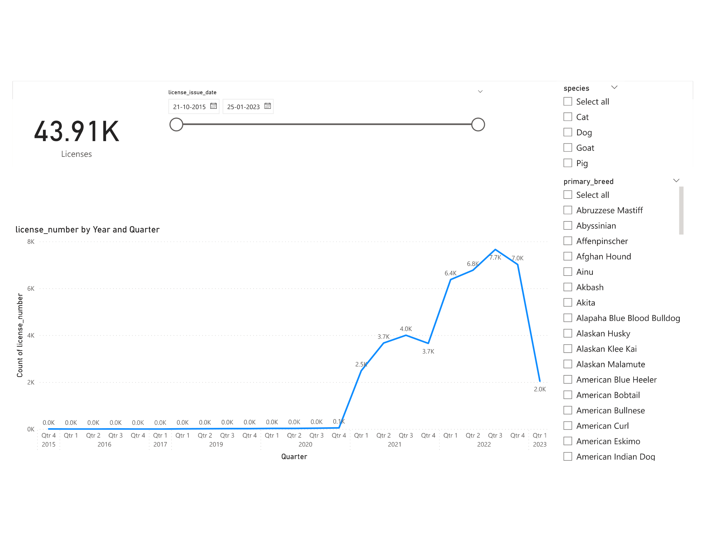

# Seattle_Pet_Licences

## Overview: 
The objective of this assignment is to explore and extract valuable insights from the Seattle Pet Licenses dataset. To accomplish this, I employed various tools:

Alteryx for data preparation and profiling
Tableau and PowerBI for creating informative data visualizations
MySQL for efficient database management

## About the dataset:
Data Source: https://data.seattle.gov/Community/Seattle-Pet-Licenses/jguv-t9rb

The dataset utilized is Seattle Pet Licenses, sourced from the City of Seattle, reflecting Seattle's dedication to responsible pet ownership and community well-being. This dataset comprises a thorough compilation of information offering valuable insights into the city's pet population. It encompasses active Seattle pet licenses from October 2015 to April 2023, detailing animal type (species), pet names, primary and secondary breeds, license issue dates, license numbers, and owner ZIP codes.

## Data Modeling

	  
    <em>Data Modeling</em>

### Visualizations 

 

	  
    <em>Tableau Dashboard</em>

 

	  
    <em>Tableau Dashboard</em>

	  
    <em>Tableau Dashboard</em>

	  
    <em>Tableau Dashboard</em>

